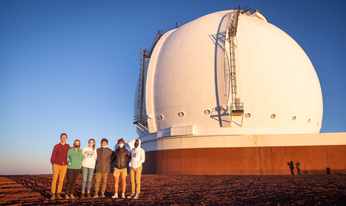



Meet some of the members of our galaxy formation research group here at F&M! Click the student names for more information on their projects.


  


***

## Former Group Members

Below are some of our former group members who are now doing other cool things in astronomy! This section of the site is still under construction, so come back again to see more profiles and project descriptions.


  

