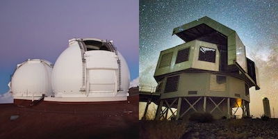
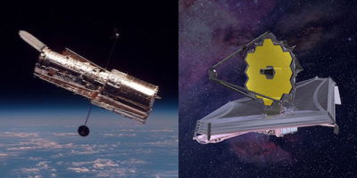

<!--
 
-->

 
Images of Keck and Magellan Telescopes &copy; R. Trainor; Images of HST and JWST &copy; NASA/ESA

You can find all my published work on the <a href="https://ui.adsabs.harvard.edu/search/q=author%3A%22Trainor%2C%20Ryan%22%20year%3A2006-&sort=date%20desc%2C%20bibcode%20desc&p_=0">NASA ADS</a> or <a href="https://scholar.google.com/citations?user=H-1xpPEAAAAJ&hl=en">my Google Scholar profile</a>.

I am an observational astronomer, and my students and I study the evolution of galaxies and
quasars over cosmic time. I am particularly interested in the evolution of the faintest galaxies in the peak epochs of star formation and
black hole accretion (2 < *z* < 3, 10-12 billion years ago), as well as the interactions between galaxies and supermassive black holes during this time. Most of my
work uses optical and infrared images
and spectra from the <a
href="http://www2.keck.hawaii.edu/inst/lris/">LRIS</a>, 
<a href="http://irlab.astro.ucla.edu/mosfire/">MOSFIRE</a>, and 
<a href="https://www2.keck.hawaii.edu/inst/kcwi/">KCWI</a>
instruments on the 10-m Keck 1 telescope at the <a
href="http://keckobservatory.org/">W.M. Keck
Observatory</a>, as well as data from the <a
href="http://www.nasa.gov/mission_pages/hubble/main/index.html">Hubble
Space Telescope</a>. I was also part of the team that
built and commissioned MOSFIRE, and I have recently begun working with radio telescopes such as [IRAM/NOEMA](https://www.iram-institute.org/EN/noema-project.php).

## Understanding Lyman-alpha Emission

Several of  my projects focus on understanding a specific type of light called Lyman-alpha (Lya)
emission. Lya emission is emitted by excited hydrogen gas, and
excited hydrogen tends to sit near newly-formed stars and "active" black holes in galaxies. Using 
this light is therefore a good way to see where stars and black holes are forming in the Universe.

This Lya light is also complicated, however, because it is scattered by the hydrogen in galaxies
as it tries to get out. In one of our recent papers, we conducted a careful analysis of different
methods for estimating how many Lya photons were created in galaxies and how many of them escape
in order to predict the total efficiency with which these photons are detected in our 
measurements of galaxies. <a href='https://ui.adsabs.harvard.edu/abs/2019ApJ...887...85T/abstract'>(see paper)</a>

## Properties of "Baby" Galaxies

I am currently studying young
galaxies called Lyman-alpha emitters
(LAEs). These galaxies have a
lot of gas that they are
beginning to turn into
stars. Using images and
spectra from Keck and the
Hubble Space Telescope, I am
studying the properties of
stars in these galaxies and
how stellar feedback produces
heavy elements within the galaxies as
well as driving gas and
ultraviolet photons out of the galaxies.

We  published a paper
showing that these faint,
young LAE galaxies are able to
produce outflows that drive
gas (and heavy elements) out of the galaxies, but
that these outflows are much
weaker than the outflows
produced by brighter, more
massive galaxies. These
observations show that galaxy
feedback works differently at
different galaxy mass scales. <a href='https://ui.adsabs.harvard.edu/abs/2015ApJ...809...89T/abstract'>(see paper)</a>

We also published another
paper demonstrating that 
LAEs have extreme properties
that suggest the presence of
very pristine gas (without
much heavy element
contamination) and very hot
populations of massive
stars. These stars may be
produced by the evolution of
binary systems, as described
by new models of stellar
evolution. This work would not
have been possible without the
new instrument MOSFIRE
described below. <a href='https://ui.adsabs.harvard.edu/abs/2016ApJ...832..171T/abstract'>(see paper)</a>

## Gas and Dark Matter Environments of QSOs
			
Hyperluminous QSOs are extremely bright and exceedingly rare; these objects are brighter than 10^14 solar luminosities, and there are likely only a few dozen of them in the observable universe.

By studying the spatial and velocity distribution of galaxies near the QSOs, we were able to determine that these QSOs sit in dark-matter halos of similar masses to those hosting lower-luminosity AGN and typical star-forming galaxies at these redshifts. In addition, we found that the QSOs are associated with high local densities of galaxies, which suggests that recent galaxy mergers are more important than halo mass in producing efficient (ie. hyperluminous) black-hole accretion. <a href='https://ui.adsabs.harvard.edu/abs/2012ApJ...752...39T/abstract'>(see paper)</a>

<!-- The IGM Near QSOs -->
The brighest QSOs produce intense ionizing fields that can
exceed the UVB by factors of ~1000x
over scales of an Mpc or more. This
makes the fields around QSOs
excellent places to look for
fluorescent emission, where
ionizing photons are reprocessed by
dense Hydrogen gas and reemitted as
Lya photons. Using narrow-band
filters tuned to the Lya line at the
redshift of the QSOs, we have
identified ~1000 Lyman-alpha
emitters (LAEs) that may be
exhibiting fluorescent emission, and
we have obtained ~400 spectra of the
Lya lines.

The Lya luminosity function and
distribution of Lya equivalent
widths (far exceeding those seen in
star-forming galaxies in many cases)
show strong evidence for fluorescent
emission in many of our candidates,
and the distribution of these
candidates (in redshift and
the plane of the sky) implies that
the hyperluminous QSOs in our sample have
lifetimes between 1 and 20 Myr. <a href='https://ui.adsabs.harvard.edu/abs/2013ApJ...775L...3T/abstract'>(see paper)</a>

Furthermore, our Lya spectra reveal
rich properties in their line
profiles (multi-peaked emission, red- and blue-dominant peaks, etc.)
that may tell us about their kinematics and the effects of radiative
transfer. With continuing MOSFIRE observations, we will further probe
the physical properties of these objects.

## Instrumentation

  As a member of the MOSFIRE
instrument team, I helped
calibrate and commission the
instrument, focusing in
particular in the modeling of
the instrument flexure (as it
lies at the Cassegrain focus
of the Keck 1 telescope) and
calibrating the flexure
compensation system.

MOSFIRE is now fully operational and taking beautiful NIR spectra and
					images (with minimal residual
flexure). Check <a href='http://arxiv.org/find/all/1/all:+mosfire'>astro-ph</a> or
					the <a href='http://adsabs.harvard.edu/cgi-bin/basic_connect?qsearch=mosfire&version=1'>ADS</a> for recent results!

