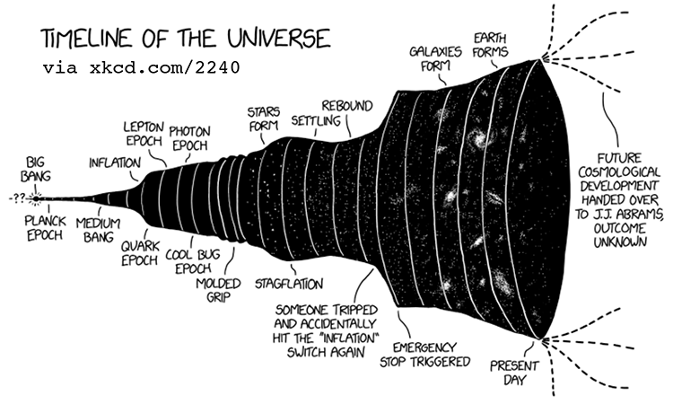

Astronomy 332 provides an introduction to extragalactic astronomy and the nature of the Universe as a whole. We will discuss our own Milky Way Galaxy and its surroundings; the roles of stars, gas, supermassive black holes, and dark matter in shaping the properties of galaxies; and their evolution over time. Beyond galaxies, we will study the large-scale structure and contents of the Universe and its expansion from the Big Bang to today. Using the theoretical framework of General Relativity, we will see how the observed properties of the Universe allow us to constrain both its nascent properties and its future evolution. Throughout the course, we will also discuss the nature of astronomy and cosmology as scientific disciplines, including the way that social forces shape these disciplines and our understanding of the Universe.

<!--

-->
