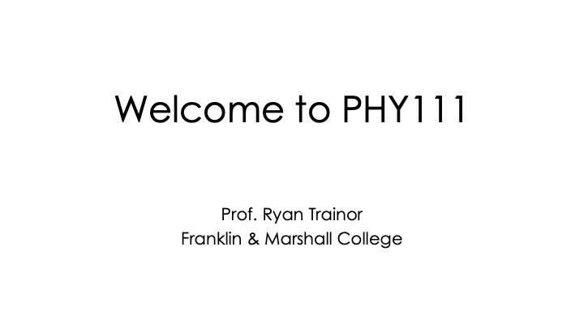

https://user-images.githubusercontent.com/17324960/137630116-6be559df-6dba-4458-933e-358cb1c46af9.mp4

https://youtu.be/D4ZQuRjs1Jc

This course provides a broad overview of the way objects move and interact in our physical world.  We work extensively with Newtonian mechanics, including force equations, energy, momentum, and rotational motion, and we will introduce concepts of oscillatory motion including waves. In our lab sections, we experience practical examples of these ideas while also learning skills for data collection and analysis and experimental design.

Along with learning these ideas, we will develop our ability to understand and explain physics through *conceptual reasoning* as well as *mathematical formulae*. By the end of this class, my goals are that you will learn to *see physics* in your every day life, *solve problems* (both practical and theoretical), and *develop intuition* about the physical nature of the Universe.

Many students come to PHY111 with negative past experiences or associations with math and physics. Whoever you are or your reasons for taking this class, I promise that physics is a skill that can be learned with practice, and I will work with you to achieve your goals for our course. Please see the video above for a fuller description of my teaching philosophy for this course (if the embedded video doesn't work, try [this link](https://drive.google.com/file/d/1Rup7_DPw0Zf8_cvyi4DnaEbiyyIuhoki/view?usp=sharing)).

<!---->

I teach this course in a "flipped" format, in which students will watch short lecture videos and respond to questions before class and then engage in active discussion and problem-solving during class. I teach the course in this way because [substantial research](https://www.harvardmagazine.com/2012/03/twilight-of-the-lecture) indicates that students learn more, retain more, and achieve higher grades compared to traditional lecture-based instruction.

