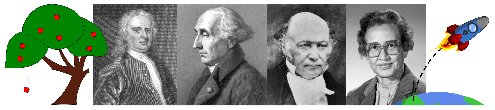

PHY 226 explores the many complexities of our world that can be described by classical physics. We will discuss topics that were swept under the rug in the introductory physics sequence: air resistance, damped springs, and physics in non-inertial reference frames like our rotating Earth. We will introduce new mathematical tools including cylindrical and spherical coordinate systems, applications of differential equations, and the calculus of variations. In the lab portion of the course, we will explore the differences between discrete and analytic formulations of physical equations, and we will use computational methods to solve problems that are intractable by hand. Together, these new skills and methods will prepare you for more advanced physics and math courses and provide a window to the methods physicists use to describe our Universe with ever-increasing levels of accuracy and precision. 

The course is organized into units, with topics and chapters from *Classical Mechanics* by John R. Taylor as given below: 
0.	Reviewing Vectors & Cartesian Coordinates (Ch. 1)
1.	Newton’s Laws & Non-Cartesian Coordinates (Ch. 1)
2.	Projectile Motion & Drag (Ch. 2)
3.	Motion in Non-Inertial Frames (Ch. 9)
4.	Momentum & Rockets (Ch. 3)
5.	Energy & Conservative Forces (Ch. 4)
6.	Calculus of Variations & Lagrange’s Equations (Ch. 6-7)
7.	Two-Body Central Forces (Ch. 8)
8.	Oscillations (Ch. 5)

<!--

-->

