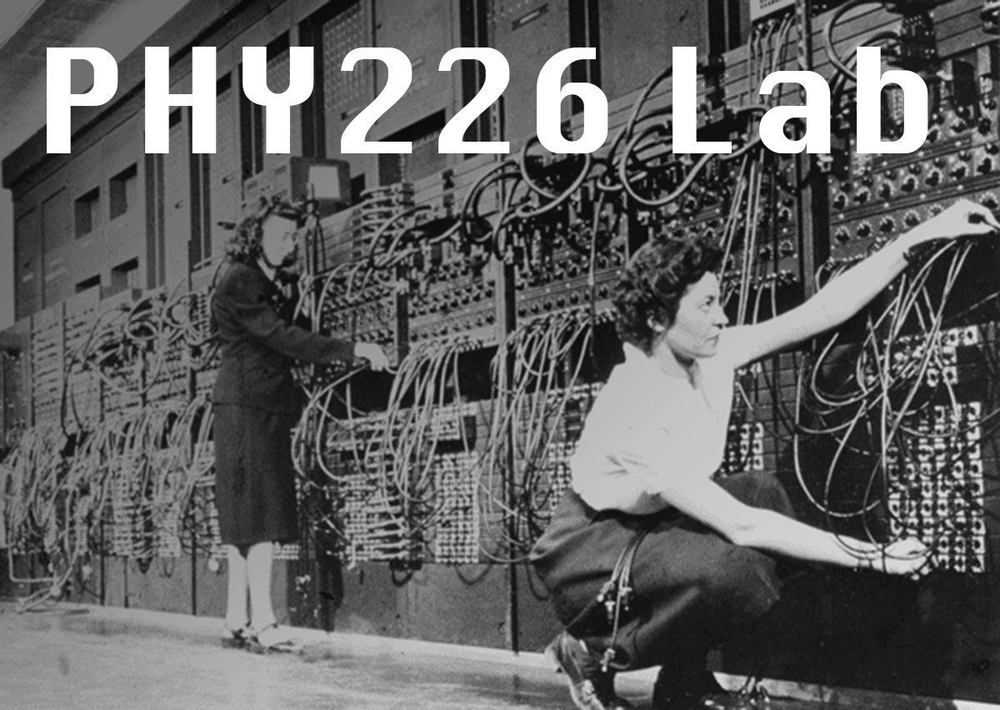

In the computational physics lab for PHY226, we develop tools to solve
physics and astrophysics problems with computers. Our class is be based on the Python programming language, but
the basic methods we will be using can be applied in many other programming languages as well.

While I hope you will become comfortable with Python (or more comfortable than you are currently)
over the course of our labs, the most important things we will learn will be how to think like a
computer programmer, including...
- Understanding the differences between "analytical" and "numerical" (i.e., "computational")
approaches to physics
- Practicing some of the common tools and algorithms used in numerical work, and
- Learning to recognize when a numerical method for solving a problem may be a useful alternative
or supplement to analytical methods.

<!--

 
 Marlyn Wescoff and Jean Jennings Wescoff programming the ENIAC computer. Image copyright Corbis / Getty Images.
 -->
